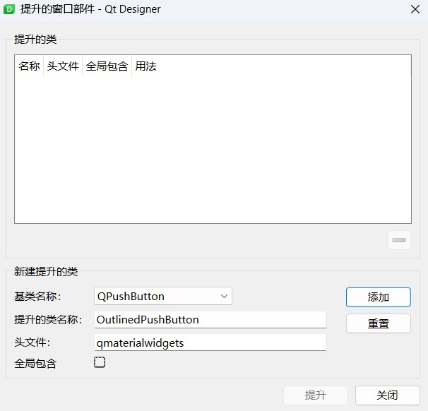

Designer
--------

In Qt Designer, there are two ways to use QMaterialWidgets.

Promoting widget
^^^^^^^^^^^^^^^^

Right click on a widget, select the ``Promote to ...`` of context menu.

Promoting a widget indicates that it should be replaced with the specified subclass, in our case the ``qmaterialwidgets.FilledPushButton``.

.. image:: ./_static/promote_context.jpg
   :target: ./_static/promote_context.jpg
   :alt:

You will be presented with a dialog to specify the custom widget class the placeholder widget will become.

The header file is the name of the Python module used to import the class, which is ``qmaterialwidgets``. Specify ``FilledPushButton`` as the class name of the widget to replace it with.

Well, the widget is now promoted to fluent push button. But you won't be able to see any changes within Qt Designer. Save the window as ``mainwindow.ui`` and compile it to python code, you will see that the ``FilledPushButton`` is imported from ``qmaterialwidgets`` package.

Using plugin
^^^^^^^^^^^^

1. create a virtual environment, ``conda`` is the recommended way.

2. Activate virtual environment and run the following code in shell:

   .. code-block:: sh

      pip install PySide6-Material-Widgets

3. Download the full code from `QMaterialWidgets Repo <https://github.com/zhiyiYo/QMaterialWidgets>`_.

4. Run ``python ./tools/designer.py`` to launch Qt Designer (You must use this way to launch Qt Designer).

If everything goes smoothly, you will see all QMaterialWidgets components in the sidebar of Qt Designer.
If the startup fails or the components of QMaterialWidgets cannot be seen, the solution can be found in `#196 <https://github.com/zhiyiYo/PyQt-Fluent-Widget/issues/196>`_.

.. image:: ./_static/Designer_plugin.jpg
   :target: ./_static/Designer_plugin.jpg
   :alt:

